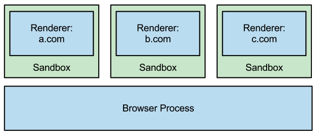
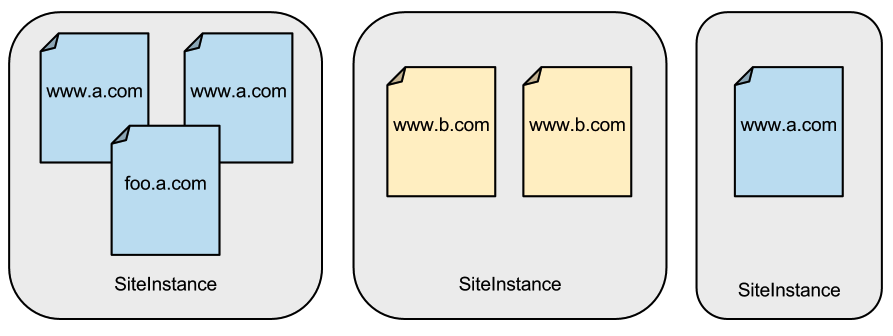

# Site\_Isolation

这个设计文档包含关于站点隔离是如何构建的技术信息。如果想看综述，见 [https://www.chromium.org/Home/chromium-security/site-isolation.](https://www.chromium.org/Home/chromium-security/site-isolation.)

## 动机

Chrome 的[多进程架构](../Start\_Here\_Background\_Reading/Multi-process\_Architecture.md)为速度、稳定性和安全性提供了许多好处。它允许在不相关的选项卡中运行的网页并行运行，并且允许用户在渲染器进程崩溃时继续使用浏览器和其他选项卡。由于渲染器进程不需要直接访问磁盘、网络或设备，因此 Chrome 也可以在受限制的[沙箱](https://www.chromium.org/developers/design-documents/sandbox)中运行它们。这[限制了](http://crypto.stanford.edu/websec/chromium/)攻击者在利用渲染器中的漏洞时可能造成的损害，包括使攻击者难以访问用户的文件系统或设备，以及特权页面（例如设置或扩展）和其他配置文件中的页面（例如隐身模式）。

<figure><figcaption></figcaption></figure>

然而，长期以来，使用 Chrome 的沙箱技术以实现更大的安全性优势一直是一个很好的机会：将网站相互隔离。直到版本 67，Chrome 在可能的情况下努力将来自不同网站的页面放置在不同的渲染器进程中，但由于兼容性限制，有许多情况下来自不同站点的页面共享一个进程（例如，跨站点 iframe）。在这些情况下，我们曾经依赖渲染器进程执行同源策略并使网站相互隔离。

本页面描述了我们的 “站点隔离” 努力，以改进 Chrome 使用沙箱渲染器进程作为网站之间的安全边界，即使在渲染器进程存在漏洞的情况下也是如此。我们的目标是确保渲染器进程可以被限制为仅包含来自最多一个网站的页面。然后，浏览器进程可以根据需要专用进程的网站限制该进程对 cookie 和其他资源的访问。

**状态：** Chorme67 里站点隔离在桌面平台（对所有站点）是默认开启的，Chrome77 里安卓平台（对用户登录的站点）是默认开启的。这有助于防御[投机性侧信道攻击](https://security.googleblog.com/2018/01/todays-cpu-vulnerability-what-you-need.html)（例如Spectre），并且（在桌面上）防御UXSS和完全被攻击的渲染器进程。

## 威胁模型

对于“一个站点一个进程”的安全策略，我们假设攻击者可以说服用户访问一个利用渲染器进程漏洞的页面，从而允许攻击者在沙箱中运行任意代码。我们还假设攻击者可能使用[投机性侧信道](https://security.googleblog.com/2018/01/todays-cpu-vulnerability-what-you-need.html)攻击（例如Spectre）来读取渲染器进程内的数据。我们关注想要窃取信息或者滥用授予其他网站权限的攻击者。

在这里，我们用一个原则精确定义 **site**：页面的站点包括方案（scheme）和注册域名，包括公共后缀，但忽略子域名、端口或路径。我们使用站点而不是 origins 来避免破坏现有网页的兼容性，这些网页可能会修改其  document.domain 以在子域之间进行通信。

对于提出的策略，我们考虑以下威胁（如果我们完全实现了的话）：

* **窃取跨站点 cookie 和 HTML5 存储的数据。**我们可以防止渲染器进程从其他站点接收 cookie 或存储的数据。
* **窃取跨站点 HTML、XML 和 JSON 数据。**使用 MIME 类型和内容嗅探，我们可以防止渲染器进程加载大多数敏感的跨站点数据。但是，我们无法阻止所有跨站点资源，因为图像、脚本和其他不透明文件允许跨站点。&#x20;
* **窃取保存的密码。**我们可以防止渲染器进程从其他站点接收保存的密码。&#x20;
* **滥用授予另一个站点的权限。**我们可以防止渲染器进程使用用户授予其他站点的权限，例如地理位置。
* **破坏 X-Frame-Options。**我们可以防止渲染器进程在 iframes 中加载跨站点页面。这允许浏览器进程根据 X-Frame-Options 或 CSP frame-ancestors 标头决定是否可以在 iframe 中加载给定站点。&#x20;
* **通过 UXSS 漏洞访问跨站点 DOM 元素。**利用渲染器进程中的通用跨站点脚本漏洞的攻击者将无法访问跨站点页面的 DOM 元素，这些元素不会位于同一渲染器进程中。&#x20;

我们不希望通过此策略减轻传统的跨站点攻击或发生在受害站点页面内的攻击，例如 XSS、CSRF、XSSI 或点击劫持。

## 需求

为了在多进程 Web 浏览器中支持 “一个站点一个进程” 的策略，我们需要确定不能分成多个进程的最小单元。这实际上不是单个页面，而是来自同一网站的文档组，它们相互引用。这些文档可以完全访问彼此的内容，并且必须在单个线程上运行，而不是并发运行。此组可能跨越多个帧或选项卡，并且可能来自同一站点的多个子域。

<figure><figcaption></figcaption></figure>

HTML 规范将这个组称为 “[相关的类似起源浏览上下文单元](http://dev.w3.org/html5/spec/single-page.html#unit-of-related-similar-origin-browsing-contexts)”。在 Chrome 中，我们将其称为 **SiteInstance**。SiteInstance 中的所有文档都可以相互使用脚本，因此我们必须在同一进程中呈现它们。

请注意，单个选项卡可能从一个网站导航到另一个网站，因此它可能在不同的时间显示不同的 SiteInstances。为了支持 “一个站点一个进程” 的策略，浏览器必须能够在这些导航之间在渲染器进程之间进行切换。

此外，某些 JavaScript 交互（例如 postMessage() 或 close()）允许在窗口或帧之间运行，即使他们显示来自不同站点的文档。必须支持这些有限的渲染器进程之间的交互。

此外，顶级文档可能包含来自不同网站的 iframe。这些 iframe 具有自己的安全上下文，并且必须基于它们自己的站点而不是其父框架的站点进行呈现。

最后，重要的是，即使从像图像或脚本标记这样的上下文中请求，敏感的跨站点数据也不会传递到渲染器进程中。这需要确定允许哪些响应以及哪些响应要阻止。

## 项目进展&#x20;

正如我们在[进程模型](../General\_Architecture/Process\_Models.md)页面上所描述的，最初有一些情况，Chrome（在版本 67 之前）会将来自不同站点的文档放在同一个渲染器进程中。这使得 Chrome 与具有跨站点 iframe 的现有网页兼容，至少在启用 Site Isolation 之前是这样。以下是一些当时共享一个进程的跨站点页面的例子：

* 跨站点 iframe 通常与其父文档托管在同一个进程中。
* 大多数渲染器发起的导航（包括链接点击、表单提交和脚本导航）即使跨越站点边界也会保留在当前进程中。这是因为同一进程中的其他窗口可能会尝试使用 postMessage 或类似的调用与它们交互。
* 如果创建了太多的渲染器进程，Chrome 开始重用现有的进程而不是创建新的进程。这减少了内存开销。&#x20;

但是，当时，Chrome 已经朝着站点隔离方向迈出了很大的一步。例如，它为浏览器进程发起的跨站点导航（例如 omnibox 导航或书签）切换了渲染器进程。跨源 JavaScript 交互在进程之间得到了支持，例如 postMessage() 和导航另一个窗口。Chrome 最终也支持了一些上下文中的跨进程 iframe。

早期的进展使我们能够针对某些类型的页面使用更严格的安全策略，例如特权 WebUI 页面（例如设置页面）。即使在单个选项卡中导航时，这些页面也永远不允许与常规网页共享进程。从兼容性的角度来看，这通常是可以接受的，因为正常页面和 WebUI 页面之间不需要脚本，并且这些页面永远不会在非特权页面的子框架中加载。

从 Chrome 56 开始，Chrome 开始使用进程外 iframe 来[防止 Web 内容进入特权扩展进程](https://blog.chromium.org/2017/05/improving-extension-security-with-out.html)。

从 Chrome 63 开始，可以通过企业策略[启用](https://support.google.com/chrome/answer/7623121?hl=en)站点隔离，以作为对[普遍跨站点脚本（UXSS）漏洞和 Spectre 的额外缓解措施](https://www.chromium.org/Home/chromium-security/site-isolation)。该初始支持仍在进行中，并且存在已知问题和权衡，但通过将来自不同站点的页面放在不同的进程中以防止跨站点数据泄漏，有助于防御 UXSS 漏洞和 Spectre。该功能尚未减轻渲染器进程中任意远程代码执行的攻击；随着浏览器进程中的其他强制执行措施的完成，这将在以后成为可能。

在 Chrome 67 中，站点隔离已在桌面平台（Windows、Mac、Linux 和 ChromeOS）上为所有站点启用，有助于防御 Spectre。

在 Chrome 77 中，站点隔离也已在至少具有 2 GB RAM 的 Android 设备上启用，但仅适用于用户登录的站点（以降低内存开销）。到此时，桌面上的站点隔离（即具有完整站点每进程策略）还可以防御完全被攻击的渲染器进程。

## 项目任务

为了支持 Chrome 的站点级进程策略，我们需要完成以下任务。这些任务确保跨站点导航和脚本交互不会中断，尽管所有来自不同站点的页面都在不同的进程中。bug跟踪在 https://crbug.com/467770。

* **跨进程导航。**任何导航到不同网站的操作都需要在当前选项卡或框架中进行进程交换。_状态_：已完成。跨进程导航在所有框架中都得到支持，并且用于许多情况：跨站点主框架导航、带外进程 iframe、将特权 WebUI 或扩展页面与网页隔离等等。
* **跨进程 Javascript。**允许来自不同站点的页面之间进行一些窗口和框架级别的交互。如上所述，常见的例子包括 postMessage、close、focus、blur 和对 window.location 的赋值，特别是不包括对页面内容的任何访问。这些交互通常可以异步进行，并且可以通过向适当的渲染器进程传递消息来实现。_状态_：已完成。Chrome 支持所有必需的交互，包括帧占位符、postMessage、close、closed、focus、blur 和在不同进程中的顶级窗口之间对 window.location 的赋值。
* **进程外 iframes 。**Iframes 具有与其父文档不同的安全上下文，因此跨站点 iframes 必须在与其父文档不同的进程中呈现。同样重要的是，与弹出窗口来源相同的 iframe 应与弹出窗口共享进程，而不是其自己的父页面。我们将这些带进程外 iframes 渲染为单独的 RenderFrame，组合到正确的视觉位置，就像插件一样。这是支持站点级进程的最大要求，因为它涉及对 Chrome 和 Blink 代码库的重大架构更改。_状态_：已完成。第一个使用[进程外 iframes](https://www.chromium.org/developers/design-documents/oop-iframes)（OOPIFs）的实例是在 Chrome 56 中推出的，将扩展与 Web 内容隔离开来。在 Chrome 67 上启动了广泛的跨站点 iframes 使用，而在 Chrome 77 上启动了 Android。跟踪网址为 https://crbug.com/99379。
* **阻止跨源读取。**虽然任何给定的站点都可以请求许多类型的跨站点资源（例如脚本和图像），但浏览器进程应该防止它接收跨站点 HTML、XML 和 JSON 数据（基于 MIME 类型和内容嗅探的组合）。_状态_：已完成。我们最初的跨站点文档阻止策略设计演变为跨源读取阻止（CORB），并提供了 CORB 说明。当启用站点隔离时，这适用于未被攻击的渲染器进程，从 Chrome 63 开始实施；对于受到攻击的渲染器，从 Chrome 77 开始实施。该工作在 https://crbug.com/268640 上进行跟踪。
* **浏览器进程增强。**浏览器进程执行的一些Chrome安全检查是在渲染器进程中执行的。当将进程锁定到给定站点时，浏览器进程可以自行强制执行许多这些检查，从而限制受攻击的渲染器进程在攻击中可以实现的内容。这包括尝试访问特定于站点的存储数据和权限，以及其他尝试欺骗浏览器进程的尝试。_状态_：大多数强制措施已经到位，但更多强制措施在 https://crbug.com/786673 上进行跟踪。
* **改善渲染进程限制策略。**我们已经研究了限制 Chrome 在站点隔离模式下创建的额外进程数量的方法。其中一种选择是支持仅隔离一组起源或站点（即–isolate-origins），而不是所有站点（即–site-per-process）。但是，鉴于我们目前的发现，我们目前倾向于隔离所有站点。请注意，来自一个站点的页面可能会重用已经用于该站点的进程，并且我们会尽可能地在子框架中以这种方式重用进程。进程不会被重用于跨站点页面。_状态_：在桌面上，我们隔离所有站点，仅允许从同一站点的页面重用进程。在 Android 上，只有一部分站点最终进入专用进程。

## 性能

Site Isolation 对 Chrome 的性能影响进行监控是这项工作的关键部分。Site Isolation 可以在多个方面对性能产生影响，既有积极的影响，也有消极的影响：一些帧可能通过与页面的其余部分并行运行而更快地呈现，但创建额外的渲染器进程也会增加内存需求，并可能在跨进程导航上引入延迟。我们正在采取多种措施来最小化产生的成本，并使用从实际浏览数据收集的指标来衡量影响。

如上所述，“Renderer Process Limit Policy” 下，我们调查了一种通过仅隔离一部分网站来减少进程数量的选项。在这种模式下，大多数网站将继续使用 Chrome 的旧进程模型，而用户可能会登录的网站将被隔离。但是，我们目前的目标是尽可能隔离所有站点，基于当前的性能测量、简单性和额外的保护。

我们的评估在我们的 USENIX Security 2019 论文中进行了描述：[Site Isolation: Process Separation for Web Sites within the Browser。](https://www.usenix.org/conference/usenixsecurity19/presentation/reis)

## 如何启用

如何启用以及设置站点隔离的更多细节，参见 [Site Isolation Overview page](https://www.chromium.org/Home/chromium-security/site-isolation). 大部分情况下，不需要做任何事。

## 开发者资源

更新中的 Chrome Features：

* [Feature Update FAQ for Out-of-Process iframes](https://docs.google.com/document/d/1Iqe\_CzFVA6hyxe7h2bUKusxsjB6frXfdAYLerM3JjPo/edit?usp=sharing)
* [Features to Update for Out-of-Process iframes](https://docs.google.com/document/d/1dCR2aEoBJj\_Yqcs6GuM7lUPr0gag77L5OSgDa8bebsI/edit?usp=sharing)

编译状态:

* Site Isolation FYI bots: [Linux](http://build.chromium.org/p/chromium.fyi/builders/Site%20Isolation%20Linux) and [Windows](http://build.chromium.org/p/chromium.fyi/builders/Site%20Isolation%20Win)
* Site Isolation try bot: [linux\_site\_isolation](http://build.chromium.org/p/tryserver.chromium.linux/builders/linux\_site\_isolation)

### 2015 Site Isolation 顶会演讲 

2015 年 1 月以来的研究和讨论。

### 站点隔离综述 

[Slides](https://docs.google.com/presentation/d/10HTTK4dsxO5p6FcpEOq8EkuV4yiBx2n6dBki8cqDWyo/edit?usp=sharing)

### Chromium Changes for OOPIF

[Slides](https://docs.google.com/presentation/d/1e25K7BW3etNDm1-lkMltMcCcRDeVwLibBcbACRhqZ1k/edit?usp=sharing)

### Blink Changes for OOPIF

[Slides](https://docs.google.com/presentation/d/11nrXiuXBTC72E5l\_MUtu2eJN6rcW9PtBewDOPPTk9Bc/edit?usp=sharing)

## Discussions/Questions

站点隔离的技术讨论邮箱列表为 [site-isolation-dev@chromium.org](mailto:site-isolation-dev@chromium.org).
