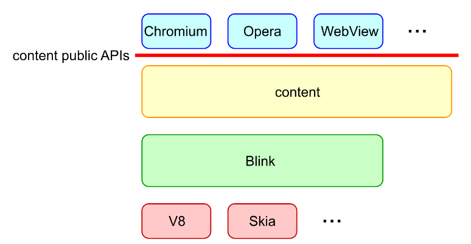
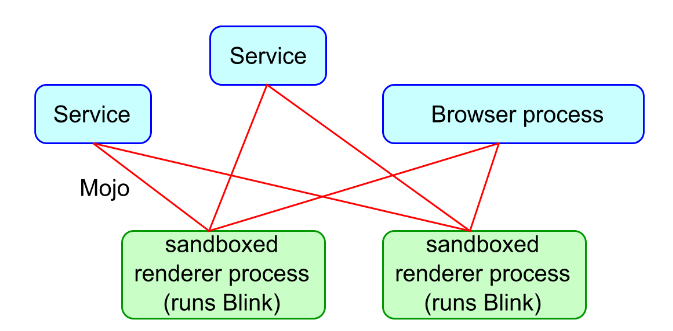
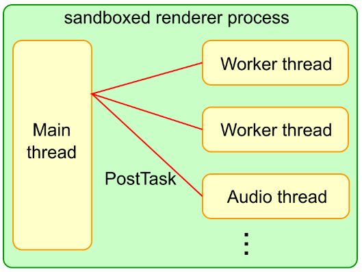
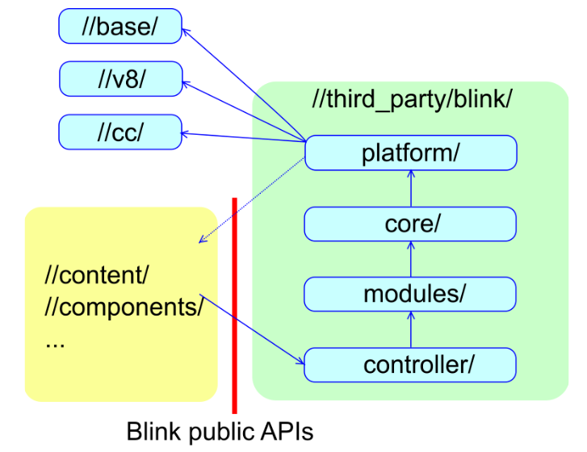
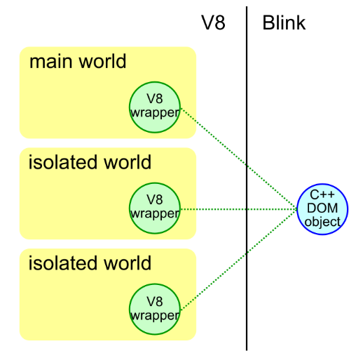
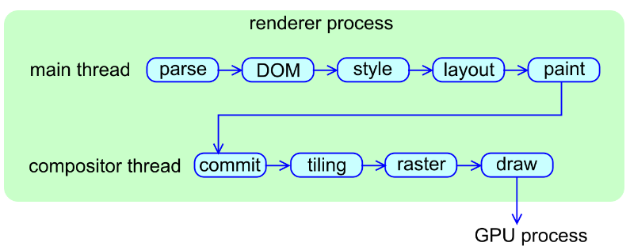

# Blink如何工作

Blink如何工作

bit.ly/how-blink-works

作者：haraken@

最后更新：2018年8月14日

状态：公开


在Blink上工作并不容易。对于新的Blink开发者来说，不容易，因为有很多Blink特有的概念和编码规范，这些是为了实现一个非常快速的渲染引擎而引入的。对于有经验的Blink开发者来说，也不容易，因为Blink非常庞大，对性能、内存和安全非常敏感。

这份文档旨在用简单易懂的方式介绍'Blink是如何运作的'，希望能帮助Blink开发者快速了解架构：

* 本文不是一个关于Blink的详细架构和编码规则的彻底教程（这些可能会改变和过时）。相反，本文简洁地描述了Blink的基本原理，这些原理在短期内不太可能改变，并指出了一些您可以阅读的资源，以便您了解更多。
* 本文不解释具体的特性（例如，ServiceWorkers，编辑）。相反，本文解释了一些被广泛的代码库使用的基本特性（例如，内存管理，V8 APIs）。

关于Blink开发的更一般的信息，请参见 [Chromium wiki页面](https://www.chromium.org/blink) .

## Blink做了什么？

[Blink](https://www.chromium.org/blink) 是Web平台的渲染引擎。大致上来说，Blink实现了在浏览器标签内呈现内容的所有内容：

* 实现Web平台规范（例如[HTML标准](https://html.spec.whatwg.org/multipage/?)），包括DOM、CSS和Web IDL
* 嵌入V8并运行JavaScript
* 从底层网络堆栈请求资源
* 构建DOM树
* 计算样式和布局
* 嵌入[Chrome Compositor](https://chromium.googlesource.com/chromium/src/+/HEAD/cc/README.md)并绘制图形

Blink通过[内容公共API](https://chromium.googlesource.com/chromium/src/+/HEAD/content/public/README.md)由许多客户端嵌入，例如Chromium、Android WebView和Opera。

<figure><figcaption><p>blink_arch</p></figcaption></figure>

从代码库的角度来看，“Blink”通常指的是//third\_party/blink/。从项目的角度来看，“Blink”通常指的是实现Web平台功能的项目。实现Web平台功能的代码涵盖了//third\_party/blink/、//content/renderer/、//content/browser/等多个位置。

## 进程/线程架构

### 进程

Chromium具有[多进程架构](Multi-process\_Architecture.md)。Chromium有一个浏览器进程和N个沙盒化的渲染器进程。Blink在渲染器进程中运行。

有多少个渲染器进程被创建？出于安全原因，重要的是在跨站点文档之间隔离内存地址区域（这称为[站点隔离](../Feature-Specific/Site\_Isolation.md)）。从概念上讲，每个渲染器进程应该专门用于至多一个站点。然而，实际上，当用户打开太多选项卡或设备没有足够的RAM时，将每个渲染器进程限制为单个站点有时会太重。然后，一个渲染器进程可以由从不同站点加载的多个iframe或选项卡共享。这意味着一个选项卡中的iframe可能由不同的渲染器进程托管，而不同选项卡中的iframe可能由同一个渲染器进程托管。**渲染器进程、iframe和选项卡之间没有1:1的映射关系。**

由于渲染器进程在沙箱中运行，Blink需要请求浏览器进程分派系统调用（例如文件访问、播放音频）并访问用户配置文件数据（例如cookie、密码）。这种浏览器-渲染器进程通信是通过[Mojo](https://chromium.googlesource.com/chromium/src/+/master/mojo/README.md)实现的。（注意：过去我们使用的是[Chromium IPC](https://www.chromium.org/developers/design-documents/inter-process-communication)，现在仍有很多地方在使用它。但是，它已被弃用并在底层使用Mojo。）在Chromium方面，[服务化](https://www.chromium.org/servicification)正在进行中，并将浏览器进程抽象为一组“服务”。从Blink的角度来看，Blink可以使用Mojo与服务和浏览器进程交互。

<figure><figcaption><p>mojo_service</p></figcaption></figure>

如果你想了解更多：

* [多进程架构](Multi-process\_Architecture.md)
* Blink中的mojo编程：platform/mojo/MojoProgrammingInBlink.md

### 线程

渲染进程中创建了多少线程？

Blink有一个主线程、N个工作线程和几个内部线程。

几乎所有重要的事情都发生在主线程上。所有JavaScript（除了worker线程）、DOM、CSS、样式和布局计算都在主线程上运行。Blink经过高度优化，以最大化主线程的性能，假定大多数情况下是单线程架构。

Blink可能会创建多个工作线程来运行[Web Workers](https://html.spec.whatwg.org/multipage/workers.html#workers)、[ServiceWorker](https://w3c.github.io/ServiceWorker/)和[Worklets](https://html.spec.whatwg.org/multipage/worklets.html)。

Blink和V8可能会创建几个内部线程来处理webaudio、数据库、GC等。

对于跨线程通信，必须使用PostTask API进行消息传递。除了一些确实需要出于性能原因使用共享内存编程的地方外，不鼓励使用共享内存编程。这就是为什么在Blink代码库中看不到太多互斥锁的原因。

<figure><figcaption></figcaption></figure>

如果你想要了解更多：

* Blink中的线程编程：platform/wtf/ThreadProgrammingInBlink.md
* Workers: [core/workers/README.md](https://chromium.googlesource.com/chromium/src/+/master/third\_party/blink/renderer/core/workers/README.md)

### Blink的初始化与终止

Blink由BlinkInitializer::Initialize()初始化。在执行任何Blink代码之前，必须调用此方法。

另一方面，Blink从不被终止；即，渲染器进程在没有被清理的情况下被强制退出。一个原因是性能。另一个原因是通常很难以优雅有序的方式清理渲染器进程中的所有内容（并且这不值得努力）

## 目录结构

### 内容公开 API 和 Blink 公开 API

[Content public APIs](https://cs.chromium.org/chromium/src/content/public/) （内容公共API）是使嵌入器能够嵌入渲染引擎的API层。内容公共API必须得到精心维护，因为它们对嵌入器是可见的。

[Blink public APIs](https://cs.chromium.org/chromium/src/third\_party/blink/public/?q=blink/public\&sq=package:chromium\&dr)，将//third\_party/blink/中的功能暴露给Chromium。这个API层只是从WebKit继承下来的历史遗物。在WebKit时代，Chromium和Safari共享了WebKit的实现，因此需要API层将WebKit的功能暴露给Chromium和Safari。现在，Chromium是//third\_party/blink/的唯一嵌入者，API层已经没有意义。我们正在通过将Web平台的代码从Chromium移至Blink（项目称为Onion Soup）来积极减少Blink公共API的数量。

<figure><figcaption></figcaption></figure>

### 目录结构和依赖

//third\_party/blink/有以下目录。有关这些目录的更详细定义，请参见[此文档](https://chromium.googlesource.com/chromium/src/+/master/third\_party/blink/renderer/README.md)：

* platform/&#x20;
  * Blink的一组低级功能，这些功能从单片核心中分离出来。例如，几何和图形工具。&#x20;
* core/ 和 modules/&#x20;
  * 实现规范中定义的所有Web平台功能。core/ 实现与DOM紧密耦合的功能。modules/ 实现更自包含的功能。例如，webaudio、indexeddb。&#x20;
* bindings/core/ 和 bindings/modules/&#x20;
  * 从概念上讲，bindings/core 是 core/ 的一部分，bindings/modules 是 modules/ 的一部分。那些大量使用 V8 API 的文件放在 bindings/{core,modules} 中。&#x20;
* controller/&#x20;
  * 使用 core/ 和 modules/ 的一组高级库。例如，devtools前端。

依赖项如下：

* Chromium => controller/ => modules/ 和 bindings/modules/ => core/ 和 bindings/core/  => platform/ => 诸如 //base、//v8 和 //cc 之类的低级原语

Blink仔细维护了暴露给 //third\_party/blink/ 的低级原语列表。

如果您想了解更多信息：

* 目录结构和依赖关系：[blink/renderer/README.md](https://chromium.googlesource.com/chromium/src/+/master/third\_party/blink/renderer/README.md)

### WTF

WTF是一个 “Blink-specific base” 库，位于 platform/wtf/ 。我们正在尽可能统一 Chromium 和 Blink 之间的编码原语，因此 WTF 应该很小。这个库是必需的，因为有许多类型、容器和宏需要针对 Blink 的工作负载和 Oilpan（Blink GC）进行优化。如果类型在 WTF 中定义，Blink必须使用 WTF 类型，而不是在 //base 或 std 库中定义的类型。最受欢迎的是向量、哈希集、哈希映射和字符串。Blink 应该使用 WTF::Vector、WTF::HashSet、WTF::HashMap、WTF::String 和 WTF::AtomicString ，而不是 std::vector、std::\*set、std::\*map 和 std::string。

如果您想了解更多信息：

如何使用WTF：[platform/wtf/README.md](https://chromium.googlesource.com/chromium/src/+/master/third\_party/blink/renderer/platform/wtf/README.md)

## 内存管理

就Blink而言，您需要关心三个内存分配器：

* PartitionAlloc&#x20;
* Oil Pan（又名Blink GC）&#x20;
* malloc/free或new/delete（禁止使用）

您可以使用 USING\_FAST\_MALLOC() 在 PartitionAlloc 的堆上分配对象：

```
class SomeObject { 
    USING_FAST_MALLOC(SomeObject); 
    static std::unique_ptr<SomeObject> Create() { 
        return std::make_unique<SomeObject>(); 
        // 分配在PartitionAlloc的堆上。 
    } 
};
```

由 PartitionAlloc 分配的对象的生命周期应由 scoped\_refptr<> 或 std::unique\_ptr<> 管理。强烈不建议手动管理生命周期。在 Blink 中禁止手动删除。

您可以使用 GarbageCollected 在 Oilpan 的堆上分配对象：

```
class SomeObject : public GarbageCollected<SomeObject> {
  static SomeObject* Create() { 
    return new SomeObject; // 分配在Oilpan的堆上。 
  } 
};
```

由 Oilpan 分配的对象的生命周期由垃圾回收自动管理。您必须使用特殊指针（例如Member<>、Persistent<>）来保存 Oilpan 堆上的对象。请参阅此 [API参考文档](https://chromium.googlesource.com/chromium/src/+/master/third\_party/blink/renderer/platform/heap/BlinkGCAPIReference.md)，以熟悉有关Oilpan的编程限制。最重要的限制是您不允许在 Oilpan 对象的析构函数中使用任何其他Oilpan 对象（因为销毁顺序不能保证）。

如果您既不使用 USING\_FAST\_MALLOC() 也不使用 GarbageCollected ，则对象将分配在系统 malloc 的堆上。这在 Blink 中是强烈不鼓励的。所有 Blink 对象都应按以下方式由 PartitionAlloc 或 Oilpan 分配：

* 默认情况下使用 Oilpan。&#x20;
* 仅在以下情况下使用 PartitionAlloc：1）对象的生命周期非常明确，std::unique\_ptr<>或scoped\_refptr<>足够，2）在Oilpan上分配对象会引入很多复杂性，或3）在Oilpan上分配对象会对垃圾收集运行时产生很多不必要的压力。

无论您使用 PartitionAlloc 还是 Oilpan，都必须非常小心，不要创建悬空指针（注意：强烈不建议使用原始指针）或内存泄漏。

如果您想了解更多信息：

* 如何使用PartitionAlloc：[platform/wtf/allocator/Allocator.md](https://chromium.googlesource.com/chromium/src/+/master/third\_party/blink/renderer/platform/wtf/allocator/Allocator.md)&#x20;
* 如何使用Oilpan：[platform/heap/BlinkGCAPIReference.md ](https://chromium.googlesource.com/chromium/src/+/master/third\_party/blink/renderer/platform/heap/BlinkGCAPIReference.md)
* Oilpan GC设计：[platform/heap/BlinkGCDesign.md](https://chromium.googlesource.com/chromium/src/+/master/third\_party/blink/renderer/platform/heap/BlinkGCDesign.md)

## 任务调度

为了提高渲染引擎的响应能力，Blink中的任务应尽可能异步执行。不鼓励同步 IPC/Mojo 和任何可能需要几毫秒的操作（尽管有些是不可避免的，例如用户的JavaScript执行）。

渲染器进程中的所有任务都应使用适当的任务类型发布到 [Blink Scheduler](https://chromium.googlesource.com/chromium/src/+/master/third\_party/blink/renderer/platform/scheduler/README.md) 中，如下所示：

```
// Post a task to frame’s scheduler with a task type of kNetworking 
frame->GetTaskRunner(TaskType::kNetworking)->PostTask(..., WTF::Bind(&Function));
```

Blink Scheduler 维护多个任务队列并智能地优先处理任务，以最大化用户感知的性能。指定正确的任务类型以使Blink Scheduler正确而智能地安排任务非常重要。

如果您想了解更多信息：

* 如何发布任务：[third\_party/blink/renderer/platform/scheduler/TaskSchedulingInBlink.md](https://chromium.googlesource.com/chromium/src/+/HEAD/third\_party/blink/renderer/platform/scheduler/TaskSchedulingInBlink.md)

## 页面，框架，文档，DOM 窗口等

### 概念

页面，框架，文档，ExecutionContext和DOMWindow是以下概念：

* 如果未启用OOPIF，则页面对应于选项卡(tabs)的概念。每个渲染器进程可能包含多个选项卡。
* 框架对应于框架（主框架或iframe）的概念。每个页面可能包含一个或多个框架，这些框架按树形层次结构排列。&#x20;
* DOMWindow 对应于 JavaScript 中的 window 对象。每个框架都有一个 DOMWindow。
* 文档对应于 JavaScript 中的 window.document 对象。每个框架都有一个文档。
* ExecutionContext是一个概念，抽象出了文档（对于主线程）和WorkerGlobalScope（对于工作线程）。

渲染器进程：页面=1：N。

页面：框架=1：M。

在任何时候，框架：DOMWindow：文档（或者说 ExecutionContext ）= 1：1：1 ，但映射可能随时间而变化。例如，请考虑以下代码：

`iframe.contentWindow.location.href = “https://example.com”;`

在这种情况下，为 https://example.com 创建了一个新的 DOMWindow 和一个新的文档。但是，框架可能会被重用。

（注意：确切地说，有些情况下会创建新文档，但 DOMWindow 和框架会被重用。甚至还有[更复杂的情况](https://docs.google.com/presentation/d/1pHjF3TNCX--j0ss3SK09pXlVOFK0Cdq6HkMcOzcov1o/edit#slide=id.g4983c55b2d55fcc7\_42)。）

如果您想了解更多信息：

* core/frame/FrameLifecycle.md

### 进程外 iframes（OOPIF）

[Site Isolation](https://www.chromium.org/developers/design-documents/site-isolation) 使事情更加安全，但也更加复杂。 :)  Site Isolation的想法是为每个站点创建一个渲染器进程。 （站点是页面的可注册域+ 1个标签及其URL方案。例如，https://mail.example.com 和 https://chat.example.com 属于同一站点，但https://noodles.com 和 https://pumpkins.com 不属于同一站点。）如果页面包含一个跨站点iframe，则该页面可能由两个渲染器进程托管。请考虑以下页面：

```
<!-- https://example.com --> 
<body> 
<iframe src=“https://example2.com”></iframe> 
</body>
```

主框架和 \<iframe> 可能由不同的渲染器进程托管。本地于渲染器进程的框架由 LocalFrame 表示，而不在渲染器进程中的框架由RemoteFrame表示。

从主框架的角度来看，主框架是 LocalFrame ，\<iframe>是 RemoteFrame 。从\<iframe>的角度来看，主框架是 RemoteFrame ，\<iframe> 是 LocalFrame 。

本地框架和远程框架（可能存在于不同的渲染器进程中）之间的通信通过浏览器进程处理。

如果您想了解更多信息：

* 设计文档：站点隔离设计文档 [Site isolation design docs ](https://www.chromium.org/developers/design-documents/site-isolation)
* 如何使用站点隔离编写代码：core/frame/SiteIsolation.md

### 分离框架/文档

框架/文档可能处于分离状态。请考虑以下情况：

```
doc = iframe.contentDocument; 
iframe.remove(); // iframe已从DOM树中分离。
doc.createElement(“div”); // 但您仍然可以在分离的框架上运行脚本。
```

棘手的事实是，您仍然可以在分离的框架上运行脚本或DOM操作。由于框架已经被分离，大多数DOM操作将失败并抛出错误。不幸的是，分离的框架的行为在浏览器之间并不真正互操作，也没有在规范中得到很好的定义。基本上期望是JavaScript应该继续运行，但大多数DOM操作应该失败并带有一些适当的异常，例如：

```
void someDOMOperation(…) { 
    if (!script_state_->ContextIsValid()) { 
        // 框架已经分离 …; 
        // 设置异常等 
        return; 
    } 
}
```

这意味着在常见情况下，Blink 在框架分离时需要执行一堆清理操作。您可以通过继承ContextLifecycleObserver 来执行此操作，如下所示：

```
class SomeObject : public GarbageCollected<SomeObject>,
public ContextLifecycleObserver { 
  void ContextDestroyed() override { 
    // 在此处执行清理操作。 
  }
  ~SomeObject() { 
    // 在此处执行清理操作不是一个好主意，因为现在执行它们为时已晚。此外，析构函数不允许触摸Oilpan堆上的任何其他对象。 
  } 
};
```

## Web IDL 绑定

当JavaScript访问 node.firstChild 时，node.h 中的 Node::firstChild() 将被调用。它是如何工作的？让我们看看 node.firstChild 的工作原理。

首先，您需要按照规范定义一个IDL文件：

```
// node.idl 
interface Node : EventTarget {
  [...] readonly attribute Node? firstChild; 
};
```

Web IDL的语法在[Web IDL规范](https://heycam.github.io/webidl/)中定义。\[...]称为IDL扩展属性。一些IDL扩展属性在Web IDL规范中定义，而其他扩展属性是[Blink特定的IDL扩展属性](https://chromium.googlesource.com/chromium/src/+/master/third\_party/blink/renderer/bindings/IDLExtendedAttributes.md)。除了Blink特定的IDL扩展属性外，IDL文件应以符合规范的方式编写（即，只需从规范中复制并粘贴）。

其次，您需要为Node定义一个C++类，并实现 firstChild 的 C++ getter：

```
class EventTarget : public ScriptWrappable { 
// 所有暴露给JavaScript的类都必须继承ScriptWrappable。 
  ...; 
};
class Node : public EventTarget { 
  DEFINE_WRAPPERTYPEINFO(); 
  // 所有具有IDL文件的类都必须具有此宏。 
  Node* firstChild() const { return first_child_; } 
};
```

通常情况下，就是这样。当您构建 node.idl 时，[IDL编译器](https://chromium.googlesource.com/chromium/src/+/master/third\_party/blink/renderer/bindings/IDLCompiler.md)会自动生成Node接口和Node.firstChild的Blink-V8绑定。自动生成的绑定在[//src\\/out/{Debug,Release}/gen/third\_party/blink/renderer/bindings/core/v8/v8\_node.h](https://cs.chromium.org/chromium/src/out/Debug/gen/third\_party/blink/renderer/bindings/core/v8/v8\_node.h?q=v8node\&sq=package:chromium\&dr=CSs\&l=11)中生成。当 JavaScript 调用 node.firstChild 时，V8 会在 v8\_node.h 中调用 V8Node::firstChildAttributeGetterCallback() ，然后调用您在上面定义的 Node::firstChild() 。

如果您想了解更多信息：

* 如何添加Web IDL绑定：[bindings/IDLCompiler.md ](https://chromium.googlesource.com/chromium/src/+/master/third\_party/blink/renderer/bindings/IDLCompiler.md)
* 如何使用IDL扩展属性：[bindings/IDLExtendedAttributes.md ](https://chromium.googlesource.com/chromium/src/+/master/third\_party/blink/renderer/bindings/IDLExtendedAttributes.md)
* 规范：[Web IDL规范](https://heycam.github.io/webidl/)

## V8 和 Blink

### Isolate，Context ，World&#x20;

当您编写涉及 V8 API 的代码时，了解 Isolate，Context 和 World 的概念非常重要。它们分别由 v8::Isolate，v8::Context 和 DOMWrapperWorld 在代码库中表示。 Isolate 对应于物理线程。Isolate : Blink 中的物理线程 = 1：1。主线程有自己的 Isolate。

工作线程有自己的 Isolate。 Context 对应于全局对象（以 Frame 为例，它是 Frame 的 window 对象）。由于每个框架都有自己的窗口对象，因此在渲染器进程中有多个 Contexts。当您调用 V8 API 时，必须确保您在正确的上下文中。否则，v8::Isolate::GetCurrentContext () 将返回错误的上下文，并且在最坏的情况下，它将导致对象泄漏并引起安全问题。

World 是支持 Chrome 扩展程序内容脚本的概念。Worlds 不对应于 Web 标准中的任何内容。内容脚本希望与 Web 页面共享 DOM ，但出于安全原因，内容脚本的 JavaScript 对象必须与 Web 页面的 JavaScript 堆隔离。 （另外，一个内容脚本的 JavaScript 堆必须与另一个内容脚本的 JavaScript 堆隔离。）为了实现隔离，主线程为 Web 页面创建一个主要的 World，并为每个内容脚本创建一个隔离的 World。主要的 World 和隔离的 World 可以访问相同的 C++ DOM 对象，但它们的 JavaScript 对象是隔离的。这种隔离是通过为一个 C++ DOM 对象创建多个 V8 包装器来实现的；即，每个 World 一个 V8 包装器。

\


<figure><figcaption></figcaption></figure>

Context，World 和 Frame 之间有什么关系？

假设主线程上有 N 个 Worlds（一个主要的 World +（N-1）个隔离的 Worlds）。然后一个 Frame 应该有 N 个窗口对象，每个窗口对象都用于一个 World。Context 是与窗口对象对应的概念。这意味着当我们有 M 个 Frames 和 N 个 Worlds 时，我们有 M \* N 个 Contexts（但是 Contexts 是惰性创建的）。

在工作线程的情况下，只有一个 World 和一个全局对象。因此只有一个 Context。

同样，当您使用 V8 API 时，应该非常小心地使用正确的上下文。否则，您将在隔离的 Worlds 之间泄漏 JavaScript 对象，并导致安全灾难（例如，来自 A.com 的扩展程序可以操纵来自 B.com 的扩展程序）。

如果您想了解更多信息：

* [bindings/core/v8/V8BindingDesign.md](https://chromium.googlesource.com/chromium/src/+/master/third\_party/blink/renderer/bindings/core/v8/V8BindingDesign.md)

### V8 APIs

V8 APIs 在 [//v8/include/v8.h](https://cs.chromium.org/chromium/src/v8/include/v8.h?q=v8.h\&sq=package:chromium\&dr=CSs\&l=10) 中定义了许多 V8 API。由于 V8 API 是低级别的且难以正确使用，因此 [platform/bindings/](https://cs.chromium.org/chromium/src/third\_party/blink/renderer/platform/bindings/?q=platform/bindings\&sq=package:chromium\&dr) 提供了一堆包装 V8 API 的帮助程序类。您应该尽可能使用帮助程序类。如果您的代码必须大量使用 V8 API，则应将文件放在 bindings/{core,modules} 中。

V8 使用句柄指向 V8 对象。最常见的句柄是 v8::Local<>，用于从机器堆栈指向 V8 对象。必须在机器堆栈上分配 v8::HandleScope 后使用 v8::Local<>。v8::Local<> 不应在机器堆栈之外使用：

```
void function () { 
  v8::HandleScope scope; 
  v8::Localv8::Object object = ...; // 这是正确的。 
}
class SomeObject : public GarbageCollected { 
  v8::Localv8::Object object_; // 这是错误的。 
};
```

如果要从机器堆栈之外指向 V8 对象，则需要使用[包装器跟踪](https://chromium.googlesource.com/chromium/src/+/master/third\_party/blink/renderer/platform/bindings/TraceWrapperReference.md)。但是，您必须非常小心，不要创建引用循环。通常情况下，V8 API 很难使用。如果您不确定自己在做什么，请咨询[ blink-review-bindings@](https://groups.google.com/a/chromium.org/forum/#!forum/blink-reviews-bindings)。

如果您想了解更多信息：

* 如何使用 V8 API 和帮助程序类：platform/bindings/HowToUseV8FromBlink.md

### V8 包装器

V8 包装器 每个 C++ DOM 对象（例如，Node）都有其对应的 V8 包装器。确切地说，每个 C++ DOM 对象在每个 World 中都有其对应的 V8 包装器。

V8 包装器对其对应的 C++ DOM 对象具有强引用。但是，C++ DOM 对象仅对 V8 包装器具有弱引用。因此，如果您想在一定时间内保持 V8 包装器的活动状态，则必须明确执行此操作。否则，V8 包装器将被过早回收，并且 V8 包装器上的 JS 属性将丢失…

```
div = document.getElementbyId (“div”); 
child = div.firstChild; child.foo = “bar”; 
child = null; 
gc(); // 如果我们什么都不做，则 | firstChild | 的 V8 包装器将被 GC 回收。 
assert(div.firstChild.foo === “bar”); //... 这将失败。
```

如果我们什么都不做，child 将被 GC 回收，因此 child.foo 将丢失。为了保持 div.firstChild 的 V8 包装器活动状态，我们必须添加一个机制，即 “只要 div 所属的 DOM 树从 V8 可达，就保持 div.firstChild 的 V8 包装器活动状态”。

有两种方法可以保持 V8 包装器的活动状态：[ActiveScriptWrappable](https://cs.chromium.org/chromium/src/third\_party/blink/renderer/bindings/core/v8/active\_script\_wrappable.h?q=activescriptwrappable\&sq=package:chromium\&dr=CSs\&l=16) 和[包装器跟踪](https://chromium.googlesource.com/chromium/src/+/master/third\_party/blink/renderer/platform/bindings/TraceWrapperReference.md)。

如果您想了解更多信息：

* 如何管理 V8 包装器的生命周期：bindings/core/v8/V8Wrapper.md&#x20;
* 如何使用包装器跟踪：[platform/bindings/TraceWrapperReference.md](https://chromium.googlesource.com/chromium/src/+/master/third\_party/blink/renderer/platform/bindings/TraceWrapperReference.md)

## 渲染管线

渲染管道 从HTML文件传递到Blink到像素显示在屏幕上有一个漫长的旅程。渲染管道的架构如下所示。

<figure><figcaption></figcaption></figure>

阅读这个[优秀的幻灯片](https://docs.google.com/presentation/d/1boPxbgNrTU0ddsc144rcXayGA\_WF53k96imRH8Mp34Y/edit#slide=id.p)，了解渲染管道的每个阶段的作用。 （我认为我无法写出比幻灯片更好的解释:-)）

如果您想了解更多信息：

* 概述：[像素的一生](https://docs.google.com/presentation/d/1boPxbgNrTU0ddsc144rcXayGA\_WF53k96imRH8Mp34Y/edit#slide=id.p)
* DOM：[core/dom/README.md ](https://chromium.googlesource.com/chromium/src/+/master/third\_party/blink/renderer/core/dom/README.md)
* 样式：[core/css/README.md ](https://chromium.googlesource.com/chromium/src/+/master/third\_party/blink/renderer/core/css/README.md)
* 布局：[core/layout/README.md ](https://chromium.googlesource.com/chromium/src/+/master/third\_party/blink/renderer/core/layout/README.md)
* 绘画：[core/paint/README.md ](https://chromium.googlesource.com/chromium/src/+/master/third\_party/blink/renderer/core/paint/README.md)
* 合成器线程：[Chromium图形](https://www.chromium.org/developers/design-documents/chromium-graphics)&#x20;

## 问题？&#x20;

您可以向 [blink-dev@chromium.org](https://groups.google.com/a/chromium.org/forum/#!forum/blink-dev)（用于一般问题）或 [platform-architecture-dev@chromium.org](https://groups.google.com/a/chromium.org/forum/#!forum/platform-architecture-dev)（用于架构相关问题）提出任何问题。我们很乐意帮助！:D
